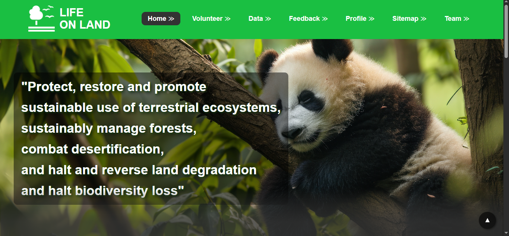
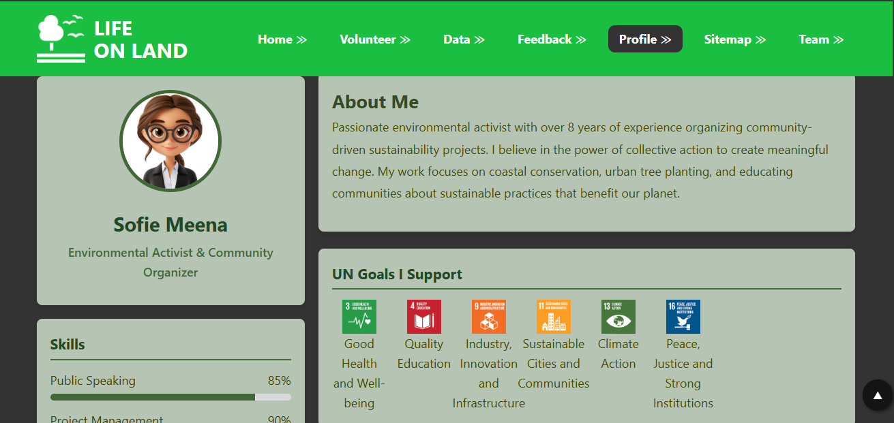
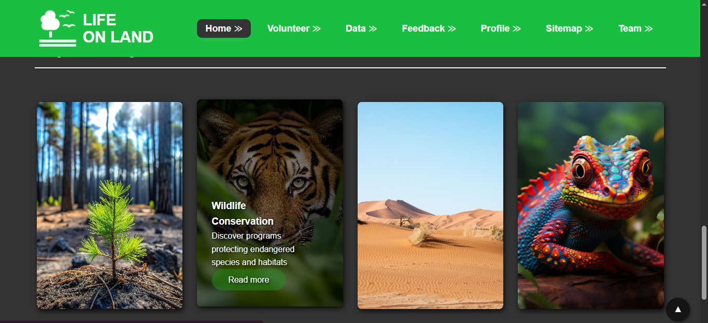
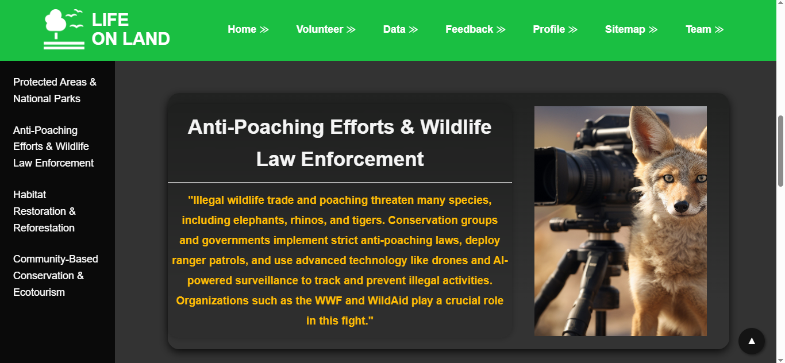

# 🌿 Life on Land — UN SDG Goal 15 | Group Coursework Website
|  |  |
|:----------------------------:|:----------------------------|
|  |  |

This is a group coursework project developed for the *Web Design and Development* module (4COSC011W) at the **University of Westminster**. The website highlights **United Nations Sustainable Development Goal (SDG) 15: Life on Land**, focusing on protecting, restoring, and promoting sustainable use of terrestrial ecosystems.

> 📌 [Live Website](https://jaindiedm.github.io/CW_IIT_WEB/)

---

## 📖 Project Overview

Our website introduces and promotes awareness of **SDG Goal 15: Life on Land** through interactive, accessible, and visually engaging web pages built using **HTML5**, **CSS3**, and **JavaScript**.  

This coursework aimed to:
- Showcase the importance of biodiversity, land restoration, and sustainable land management.
- Implement web development best practices including responsive layouts, consistent global styling, and accessible navigation.
- Practice collaborative development with a unified style guide and page templates.
- Integrate interactivity and visual effects through JavaScript and CSS animations.

---

## 👥 Team Members & Assigned Tasks

| Student | Role | Assigned Pages |
|:---------|:-------------------|:-----------------|
| Student 1 | Splash, Volunteer, Content_ST1, Editor, Validation | `splash.html`, `volunteer.html`, `content_ST1.html`, `pageEditor_ST1.html`, `validation_ST1.html` |
| Student 2 | Home Page, Table, Global CSS, Template & Navigation Bar, Content_ST2, Editor, Validation | `home.html`, `table.html`, `style.css`, `content_ST2.html`, `pageEditor_ST2.html`, `validation_ST2.html` |
| Student 3 | Feedback, Team Page, Content_ST3, Editor, Validation | `feedback.html`, `team.html`, `content_ST3.html`, `pageEditor_ST3.html`, `validation_ST3.html` |
| Student 4 | User Profile, Sitemap, Content_ST4, Editor, Validation | `profile.html`, `sitemap.html`, `content_ST4.html`, `pageEditor_ST4.html`, `validation_ST4.html` |

---

## ✨ Key Features

- **Splash Screen** with animated loader and timed redirect.
- **Responsive Navigation Bar** using a unified template across all pages.
- **Volunteer Page** showcasing volunteering opportunities for nature conservation.
- **Interactive Table** displaying land use statistics, icons, and accessible design.
- **User Profile Page** highlighting personal SDG support and volunteering schedule.
- **Feedback Form** featuring input validation, ratings, and feedback fields.
- **SVG-based Sitemap** visualizing the website’s page structure.
- **Team Page** with interactive thumbnails and expandable details.
- **Individual Content Pages** about different SDG 15 subtopics like deforestation, biodiversity loss, endangered species, and sustainable land management.
- **Validation Evidence Pages** for code correctness and accessibility.
- **Page Editors** describing the implementation details, challenges, and lessons learned.

---

## 🌳 SDG Goal 15: Life on Land Focus

This website advocates for **Life on Land (SDG 15)**, promoting awareness about:
- Protecting and restoring terrestrial ecosystems.
- Sustainable management of forests.
- Combating desertification.
- Halting biodiversity loss.

Each page and section was tailored to reflect this goal through suitable visuals, facts, content, and interactive elements.

---

## 📏 Validation & Accessibility

- All pages validated using **W3C HTML & CSS Validators**.
- Accessibility ensured via alternative texts, proper heading structures, aria labels, keyboard navigation support, and clear color contrasts.
- Compliance with University web publishing standards and Janet guidelines.

---

## 🔧 Technologies Used

- **HTML5**
- **CSS3 (External Stylesheet)**
- **JavaScript**
- **SVG (for Sitemap)**
- **GitHub Pages** for live hosting

---

## 📜 References

- UN SDGs: [https://sdgs.un.org/goals](https://sdgs.un.org/goals)
- SDG 15 Goal Overview: [Life on Land - UN Goal 15](https://sdgs.un.org/goals/goal15)
- Royalty-free images/icons: [iStockPhoto](https://www.istockphoto.com/)
- W3C HTML & CSS Validators: [validator.w3.org](https://validator.w3.org/)

---

## 📄 License

This coursework project is for educational purposes only and not intended for public distribution or commercial use.

